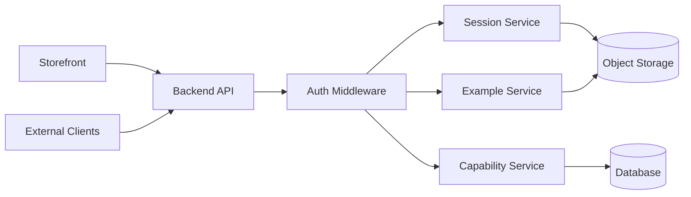

# Backend Overview

_Last reviewed: 2026-02-05_

## Purpose

The Tracepipe backend provides APIs for Session ingestion, Capability Surface management, and Example retrieval. It serves both the storefront frontend and external API consumers.

## Architecture



## Authentication

API requests require an API key in the `X-API-Key` header. Keys are generated through the [storefront](https://tracepipe.example.com) after registration and subscription.

**API Key Header Format**:
```
X-API-Key: tp_live_abcdef123456789...
```

**Example Request**:
```bash
curl -X GET https://api.tracepipe.example.com/v1/sessions \
  -H "X-API-Key: tp_live_abcdef123456789..."
```

API keys are scoped to your user account and can be revoked at any time through the storefront dashboard.

## Services

### Session Service

Handles trace ingestion from users:

- **POST** `/sessions` — Upload trace bundle (input events, network, screenshots)
  ```bash
  curl -X POST https://api.tracepipe.example.com/v1/sessions \
    -H "X-API-Key: tp_live_..." \
    -F "input_events=@input_events.jsonl" \
    -F "network_traffic=@network_traffic.jsonl" \
    -F "screenshots=@screenshots.zip" \
    -F "suite_id=<suite-uuid>"
  ```

- **GET** `/sessions/{id}` — Retrieve session metadata
  ```bash
  curl -X GET https://api.tracepipe.example.com/v1/sessions/{id} \
    -H "X-API-Key: tp_live_..."
  ```

- **GET** `/sessions` — List sessions for authenticated user
  ```bash
  curl -X GET https://api.tracepipe.example.com/v1/sessions?suite_id=<uuid> \
    -H "X-API-Key: tp_live_..."
  ```

Sessions are stored in object storage at paths defined by the data model.

### Capability Service

Manages the Capability Surface entities:

- **CRUD** `/suites` — Suite management
- **CRUD** `/suites/{id}/actions` — Action definitions
- **CRUD** `/mcp-servers` — MCP server catalog
- **CRUD** `/mcp-servers/{id}/tools` — Tool definitions
- **CRUD** `/action-tool-maps` — Suite-to-McpServer bindings

### Example Service

Provides access to processed training data:

- **GET** `/examples` — List examples, filterable by session, model, suite
  ```bash
  curl -X GET "https://api.tracepipe.example.com/v1/examples?session_id=<uuid>&suite_id=<uuid>" \
    -H "X-API-Key: tp_live_..."
  ```

- **GET** `/examples/{id}` — Retrieve example metadata
  ```bash
  curl -X GET https://api.tracepipe.example.com/v1/examples/{id} \
    -H "X-API-Key: tp_live_..."
  ```

- **GET** `/examples/{id}/messages` — Stream JSONL training messages
  ```bash
  curl -X GET https://api.tracepipe.example.com/v1/examples/{id}/messages \
    -H "X-API-Key: tp_live_..." \
    -o training_data.jsonl
  ```

### User Service

Manages user accounts and API keys:

- **GET** `/users/me` — Current user profile
- **POST** `/api-keys` — Generate new API key
- **DELETE** `/api-keys/{id}` — Revoke API key
- **GET** `/api-keys` — List active keys

## Authentication

- API keys for external access
- Session tokens for storefront access
- Scoped permissions by Suite

## Related Documents

- [Data Model](../data_model.md) — Entity schemas
- [Frontend Overview](../frontend/overview.md) — Storefront that consumes this API
- [Pipelines Overview](../pipelines/overview.md) — Session-to-Example processing
- [Backend MVP](../milestones/mvp/backend.md) — Current milestone
