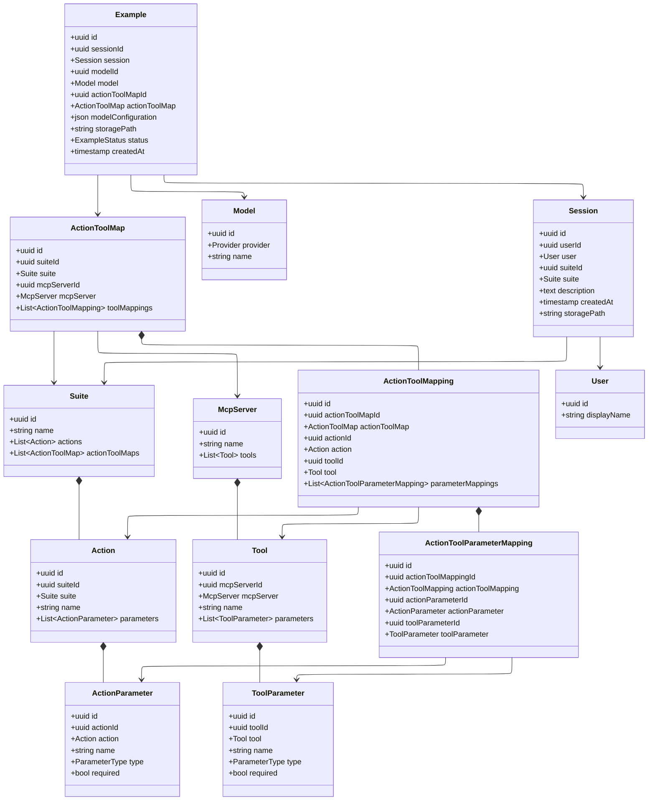
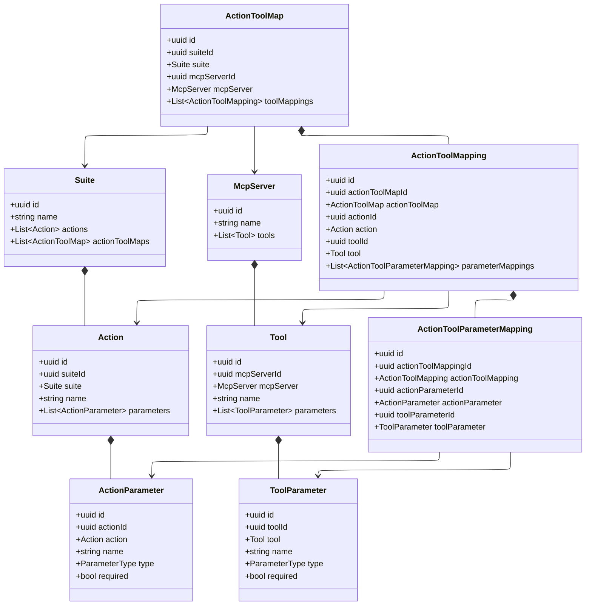
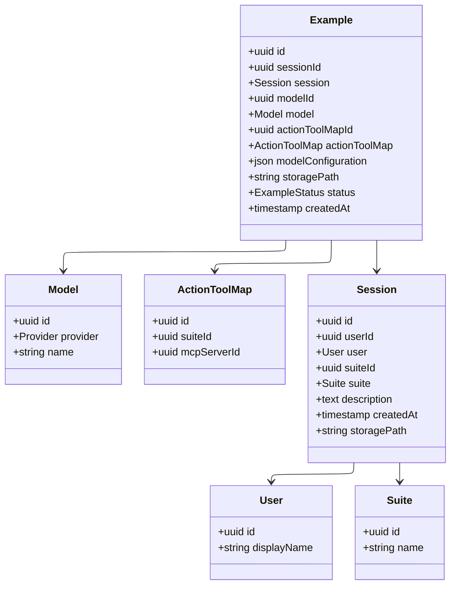

# Data Model

_Last reviewed: 2026-02-20_

## Lineage

This data model is derived from the [AutoActivity data model](https://github.com/CRSS-AI/autoactivity-docs/blob/main/docs/backend/data_model.md). The Suite, Action, Tool, and mapping entities are preserved intact. The Activity Execution layer has been simplified: Sessions represent raw trace uploads and Examples represent processed training data. The Task/Activity/Case/Instance orchestration hierarchy has been removed.

## Scope

Capture the authoritative abstractions and entities that underpin trace ingestion, suite/action/tool mapping, and training data generation.

## Modeling Principles

- **Single source of truth**: Every persistent entity has a single owning service with explicit boundaries.
- **Versioned schemas**: Breaking changes require a version bump and migration plan.
- **Typed identifiers**: Use UUID namespaces to avoid cross-entity collisions.
- **Conventional formats**: Use JSONL for serialized training examples.

## Entity Catalog



### Suite, Action, and Tool entities



### Session and Example Focus



## Entity Guidance

### Suite, Action, and Tool entities

- **Suite**: Describes the human-facing application environment (e.g., Gmail). Maintains the set of canonical `Action` definitions and available `ActionToolMap` variants.
- **Action**: Canonical action definition scoped to a Suite. Parameters capture the inputs the action expects using shared parameter metadata.
- **ActionParameter**: Defines a single action input, including type metadata (`ParameterType`) and required flags.
- **McpServer**: Describes the agent-facing tool server. Owns the concrete catalog of `Tool` contracts.
- **Tool**: Operation invokable by an agent. Each Tool references its owning McpServer and exposes parameters with the same structure as actions.
- **ToolParameter**: Mirrors `ActionParameter` structure for MCP tool inputs.
- **ActionToolMap**: Binding between a Suite and its backing McpServer tool surface. `toolMappings` keep action-to-tool bindings auditable.
- **ActionToolMapping**: Associates an Action with the specific Tool surfaced in the same ActionToolMap, plus parameter bindings.
- **ActionToolParameterMapping**: Codifies how each ActionParameter maps onto a ToolParameter.

### Execution Entities

- **Model**: Logical representation of an LLM or policy artifact, scoped by `provider` (enum) and `name`. Configuration is stored per-Example rather than per-Model.
- **User**: Representation of the human operator uploading trace data.
- **Session**: Represents a trace upload from a user. Contains raw input event trace data at `storagePath`. Sessions are scoped to a Suite. The optional `description` field (TEXT) allows users to annotate what the trace captures.
- **Example**: Processed training data derived from a Session. Links to the Model and ActionToolMap used during processing. The `modelConfiguration` field captures provider-specific parameters (temperature, routing hints). The `storagePath` points to JSONL-serialized training messages. The `status` field (`ExampleStatus` enum: `PENDING`, `PROCESSING`, `COMPLETED`, `FAILED`) tracks processing progress. `createdAt` records when the example was generated.

## Storage Conventions

### Session Storage

Session traces are stored at `storagePath` with the following structure:

```
sessions/<session-id>/
└── input_events.jsonl      # User input trace (keyboard, mouse, touch)
```

### Example Storage

Examples are stored at `storagePath` as JSONL files containing training messages:

```
examples/<example-id>/
└── messages.jsonl          # Training conversation format
```

The JSONL format follows the conventional chat completion structure with `role` and `content` fields.
