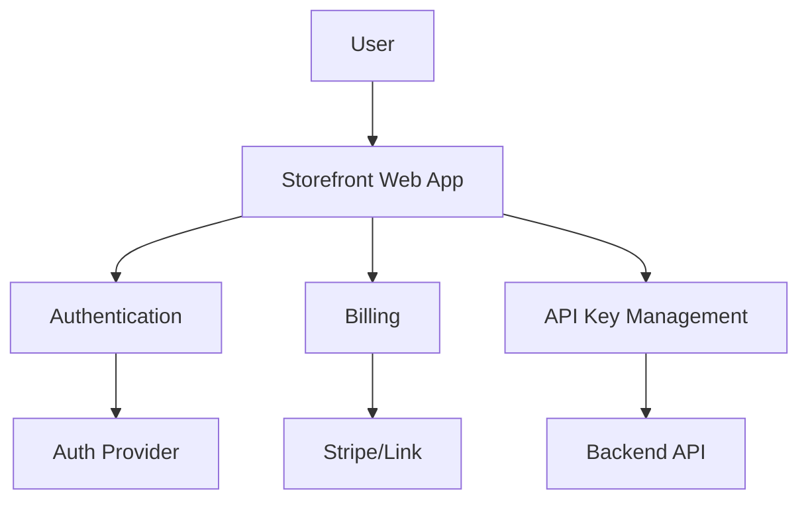

# Frontend Overview

_Last reviewed: 2026-02-05_

## Purpose

The Tracepipe frontend is a B2B SaaS storefront enabling users to register accounts, configure payment methods, and obtain API keys for accessing Tracepipe services.

## Architecture

## Key Capabilities

### User Accounts

- Registration and login via standard auth provider
- Profile management
- Organization/team support (future)

### Payments

- Stripe integration for subscription billing
- Link support for streamlined checkout
- Usage-based billing tiers
- Invoice history and management

### API Key Management

- Generate and revoke API keys
- Key scoping by Suite
- Usage monitoring dashboard
- Rate limit visibility

## Design Principles

- **Minimal moving parts**: Standard SaaS patterns, no custom infrastructure
- **Stripe-first**: Leverage Stripe's hosted checkout and customer portal
- **API-driven**: Frontend consumes Backend API for all operations

## Related Documents

- [Backend Overview](../backend/overview.md) — API that powers the storefront
- [Data Model](../data_model.md) — User entity schema
- [Frontend MVP](../milestones/mvp/frontend.md) — Current milestone
