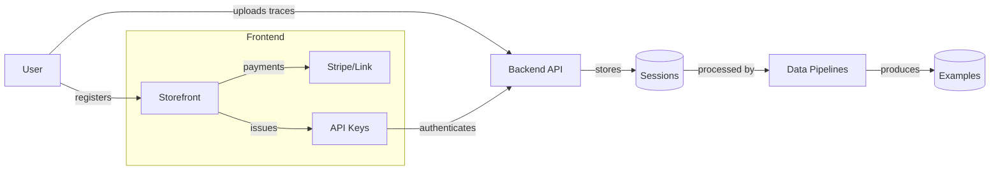

# Tracepipe Documentation

_Last reviewed: 2026-02-20_

Welcome to the canonical documentation for the Tracepipe platform. This repository serves as the source of truth for platform architecture, data models, and milestone planning.

## What is Tracepipe?

Tracepipe transforms raw browser interaction traces into high-quality training data for language models. Built for ML engineers and anyone building training datasets, Tracepipe uses action classification to convert user traces into structured examples suitable for model fine-tuning.

**The Core Value**: Upload a `chrome://traces` recording of a user interacting with a web application, and get back JSONL-formatted training messages that map those interactions to canonical actions defined in your Suite.

## How It Works

1. **Capture**: Users record browser input events via `chrome://traces`
2. **Upload**: Submit input event traces through the Tracepipe API (Sessions)
3. **Process**: Pipelines classify actions and extract parameters from input event traces
4. **Retrieve**: Download structured training data (Examples) in JSONL format, ready for model training

## Lineage

Tracepipe is derived from the [AutoActivity](https://github.com/CRSS-AI/autoactivity-docs) platform. The Suite, Action, Tool, and mapping entities are preserved intact. The execution layer has been simplified: raw trace data arrives as Sessions and is processed into Examples suitable for model training. The Task/Activity/Case/Instance orchestration hierarchy from AutoActivity has been removed.

## Who Is This For?

**Primary Audience**: ML engineers building training datasets for language models

**Use Cases**:
- Fine-tuning models for web automation tasks
- Creating training data from expert demonstrations
- Building datasets for agentic workflow models
- Generating tool-use examples from real browser interactions

**Why Tracepipe vs. Alternatives**:
- **Automated classification**: LLM-powered action identification eliminates manual labeling
- **Input event analysis**: Interprets keyboard, mouse, and touch events to understand user intent
- **Canonical action mapping**: Maps traces to your Suite's vocabulary of Actions, not raw browser events
- **Production-ready format**: Outputs JSONL suitable for direct consumption by training pipelines

## System Overview

## Subsystems

- [Frontend](frontend/overview.md) — Storefront, user accounts, payments, and API key management.
- [Backend](backend/overview.md) — Session ingestion API and Suite, Action, MCP Server, and Tool management.
- [Data Pipelines](pipelines/overview.md) — Session-to-Example processing.
- [Data Model](data_model.md) — Authoritative entity schemas and relationships.

## For UX/UI Designers

- [UX/UI Brief](ux-brief.md) — Features, selling points, user experience vision, and glossary.
- [API Reference](api-reference.md) — Static endpoint documentation for building against.

## Milestones

Active MVP initiatives:

- [Frontend MVP](milestones/mvp/frontend.md) — Storefront with Stripe payments, API key provisioning, and trace capture how-to.
- [Backend MVP](milestones/mvp/backend.md) — Session ingestion and Suite/Action/Tool APIs.
- [Pipelines MVP](milestones/mvp/pipelines.md) — Session-to-Example transformation pipeline.

## Repository Architecture

| Repository | Purpose |
|------------|---------|
| [tracepipe](https://github.com/CRSS-AI/tracepipe) | **Top-level index** — submodules all repos, centralized milestones & project board |
| [tracepipe-docs](https://github.com/CRSS-AI/tracepipe-docs) | Platform documentation |
| [tracepipe-frontend](https://github.com/CRSS-AI/tracepipe-frontend) | Storefront web application |
| [tracepipe-backend](https://github.com/CRSS-AI/tracepipe-backend) | API services |
| [tracepipe-pipelines](https://github.com/CRSS-AI/tracepipe-pipelines) | Data processing pipelines |

## How to Contribute

1. Locate the relevant subsystem and review existing documentation.
2. Update the "Last reviewed" date when meaningfully changing a page.
3. Use Mermaid for diagrams to keep them versionable.
4. Keep commits focused on a single topic.
5. Ensure milestone documents stay synchronized with GitHub milestones.
