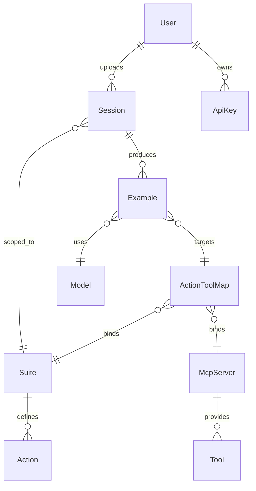
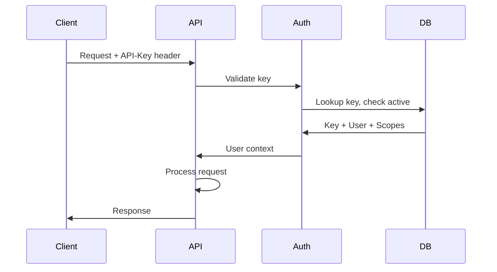

_Last reviewed: 2026-02-20_

## Goal

Deliver core API services for Session ingestion, Suite/Action/Tool management, and Example retrieval that support both the storefront frontend and external API consumers.

## Scope

- Session upload and retrieval endpoints
- Suite, Action, McpServer, and Tool CRUD
- Example retrieval endpoints
- User and API key management
- Usage reporting and invoice history endpoints
- Stripe usage reporting integration
- Authentication middleware
- A2P (Agent-to-Platform) protocol support
- MCP (Model Context Protocol) server endpoint

## Deliverables

- [ ] Session Service: POST/GET `/sessions`
- [ ] Catalog Service: CRUD for Suite, Action, McpServer, Tool
- [ ] Example Service: GET `/examples`, `/examples/{id}/messages`
- [ ] User Service: GET `/users/me`, API key CRUD
- [ ] Usage reporting: GET `/usage` (current billing period)
- [ ] Invoice history: GET `/invoices` (past billing periods)
- [ ] Stripe usage reporting integration (metered billing)
- [ ] API key authentication middleware
- [ ] A2P endpoint for agent-initiated requests
- [ ] MCP server exposing Tracepipe tools to LLM agents
- [ ] OpenAPI specification
- [ ] Database schema and migrations

## Success Criteria

1. External client can upload a Session trace bundle via API
2. Session traces are stored correctly at designated storage paths
3. Suite, Action, McpServer, and Tool entities can be created and queried
4. Examples can be listed and filtered by session/model/suite
5. API keys authenticate and authorize requests correctly
6. Usage endpoint returns accurate token/storage metrics for current billing period
7. Stripe receives usage records and generates correct invoices
8. A2P clients can submit requests and receive structured responses
7. MCP-compatible agents can discover and invoke Tracepipe tools

## Dependencies

- Object storage configuration (Azure Blob Storage)
- Database provisioning (PostgreSQL)
- Stripe account configuration (metered billing products)
- None on other MVPs—Backend can be developed first

## Risks & Mitigations

| Risk | Mitigation |
|------|------------|
| Large trace uploads timeout | Use multipart upload with chunking |
| Schema changes during development | Version API from start (`/v1/`) |
| Storage costs for traces | Implement retention policies early |

## Implementation Notes

### Technology Choices

- Python with FastAPI or similar lightweight framework
- PostgreSQL for relational data
- S3-compatible object storage for traces and examples
- Stripe for usage-based metered billing
- Pydantic for request/response validation

### Entity Relationships

### API Authentication

## Priority framework

This milestone follows an **API-first** strategy. Features that enable the straight API user flow (register → payment → API key → upload → retrieve → check usage) are P0.

| Priority | Backend features |
|----------|-----------------|
| **P0** | Auth integration, Session model/upload/retrieval, Suite/Action read endpoints, Example model/listing/retrieval/messages, API key management, usage reporting, OpenAPI spec, Model entity |
| **P1** | McpServer/Tool read endpoints, user profile, invoice history, Stripe usage integration, documentation updates, E2E tests, CI/CD |
| **P2** | MCP server interface, database seeding, SDK generation |

## Related documents

- [UX/UI Brief](../../ux-brief.md) — product context for design team
- [API Reference](../../api-reference.md) — static endpoint documentation
