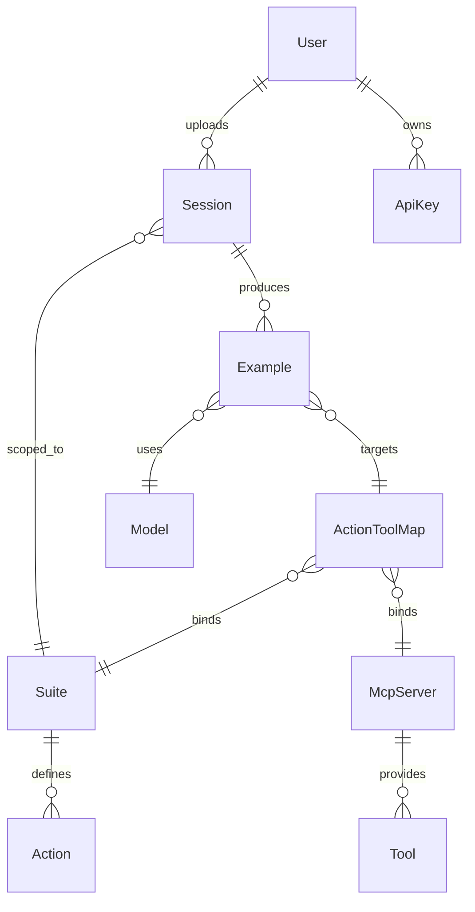
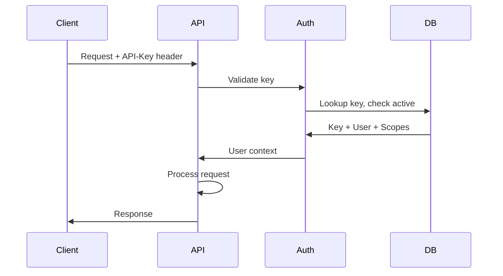

_Last reviewed: 2026-02-11_

## Goal

Deliver core API services for Session ingestion, Capability Surface management, and Example retrieval that support both the storefront frontend and external API consumers.

## Scope

- Session upload and retrieval endpoints
- Capability Surface CRUD (Suite, Action, McpServer, Tool, ActionToolMap)
- Example retrieval endpoints
- User and API key management
- Authentication middleware
- A2P (Agent-to-Platform) protocol support
- MCP (Model Context Protocol) server endpoint

## Deliverables

- [ ] Session Service: POST/GET `/sessions`
- [ ] Capability Service: CRUD for all Capability Surface entities
- [ ] Example Service: GET `/examples`, `/examples/{id}/messages`
- [ ] User Service: GET `/users/me`, API key CRUD
- [ ] API key authentication middleware
- [ ] A2P endpoint for agent-initiated requests
- [ ] MCP server exposing Tracepipe tools to LLM agents
- [ ] OpenAPI specification
- [ ] Database schema and migrations

## Success Criteria

1. External client can upload a Session trace bundle via API
2. Session traces are stored correctly at designated storage paths
3. Capability Surface entities can be created and queried
4. Examples can be listed and filtered by session/model/suite
5. API keys authenticate and authorize requests correctly
6. A2P clients can submit requests and receive structured responses
7. MCP-compatible agents can discover and invoke Tracepipe tools

## Dependencies

- Object storage configuration (S3-compatible)
- Database provisioning (PostgreSQL)
- None on other MVPs—Backend can be developed first

## Risks & Mitigations

| Risk | Mitigation |
|------|------------|
| Large trace uploads timeout | Use multipart upload with chunking |
| Schema changes during development | Version API from start (`/v1/`) |
| Storage costs for traces | Implement retention policies early |

## Implementation Notes

### Technology Choices

- Python with FastAPI or similar lightweight framework
- PostgreSQL for relational data
- S3-compatible object storage for traces and examples
- Pydantic for request/response validation

### Entity Relationships

### API Authentication

