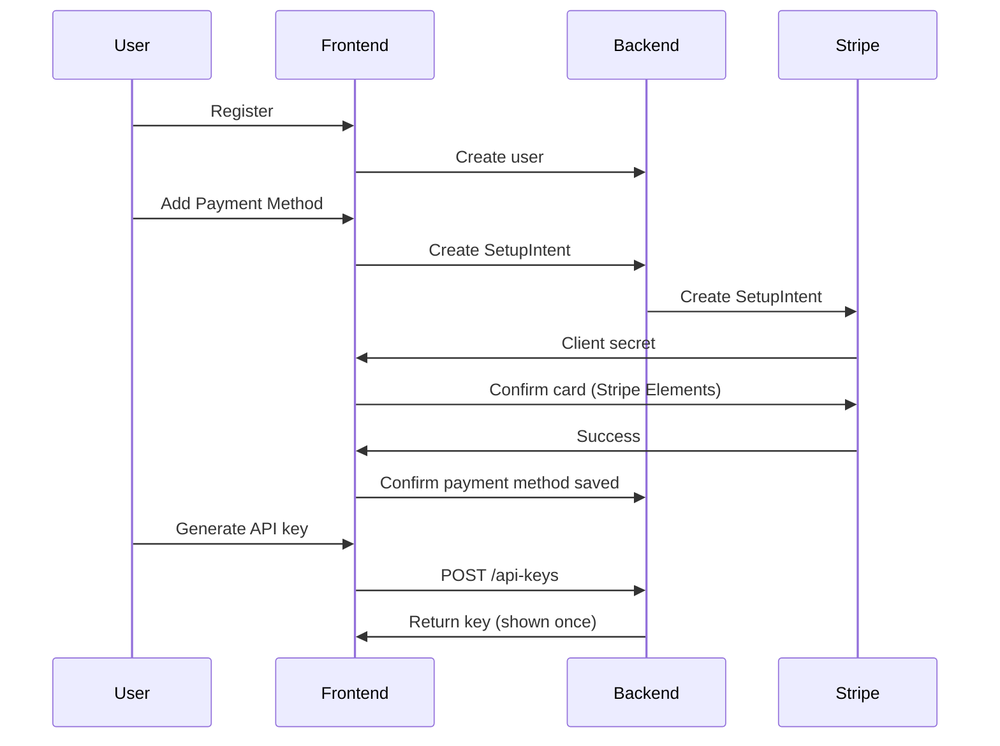

_Last reviewed: 2026-02-19_

## Goal

Deliver a functional storefront where users can register accounts, add a payment method via Stripe, and obtain API keys for accessing Tracepipe services.

## Scope

- User registration and authentication
- Stripe usage-based billing integration (card on file, metered usage)
- API key generation and management UI
- Basic usage dashboard

## Deliverables

- [ ] Landing page with product overview
- [ ] User registration and login flow
- [ ] Stripe SetupIntent integration for adding payment method (card on file)
- [ ] Payment method management (view, update card)
- [ ] Usage-based billing info display (no subscription tiers)
- [ ] API key generation page
- [ ] API key list with revocation capability
- [ ] Basic usage metrics display
- [ ] **Trace capture how-to page** — guide users through recording traces via `chrome://traces`

## Success Criteria

1. New user can register, add payment method, and generate an API key in under 5 minutes
2. Payment method saved via Stripe SetupIntent (test mode) without immediate charge
3. API keys authenticate successfully against Backend API
4. User can view and revoke their API keys
5. Trace capture how-to page clearly explains `chrome://traces` usage and event category selections

## Dependencies

- Backend MVP: User and API key endpoints must be available
- Stripe account configuration
- Azure AD B2C (Microsoft Entra External ID) tenant configuration

## Risks & Mitigations

| Risk | Mitigation |
|------|------------|
| Stripe integration complexity | Use Stripe SetupIntent for card capture; metered billing via Stripe Usage Records |
| Auth provider configuration | Use Azure AD B2C (Microsoft Entra External ID) with existing Azure infrastructure |
| Scope creep to admin features | Defer organization/team management to future milestone |

## Implementation Notes

### Technology Choices

- Prefer static-first architecture (Next.js, Astro, or similar)
- Use Stripe SetupIntent for payment method capture and Usage Records for metered billing
- Use Azure AD B2C (Microsoft Entra External ID) for authentication
- Minimal backend requirements—most state lives in Stripe and Backend API

### API Key Flow

## Related Documents

- [Frontend Overview](../../frontend/overview.md)
- [Backend MVP](backend.md)
- [Data Model](../../data_model.md) — User entity
- [UX/UI Brief](../../ux-brief.md) — product context for design team
- [API Reference](../../api-reference.md) — static endpoint documentation

## Priority framework

This milestone follows an **API-first** strategy. Features that enable the straight API user flow (register → payment → API key → use API) are P0. Web UI features for the same capabilities are P1.

| Priority | Frontend features |
|----------|------------------|
| **P0** | Project scaffolding, authentication, API key management page, Stripe billing integration |
| **P1** | Landing page, user dashboard, usage dashboard, session upload page, trace capture how-to |
| **P2** | Integration tests, CI/CD pipeline |
