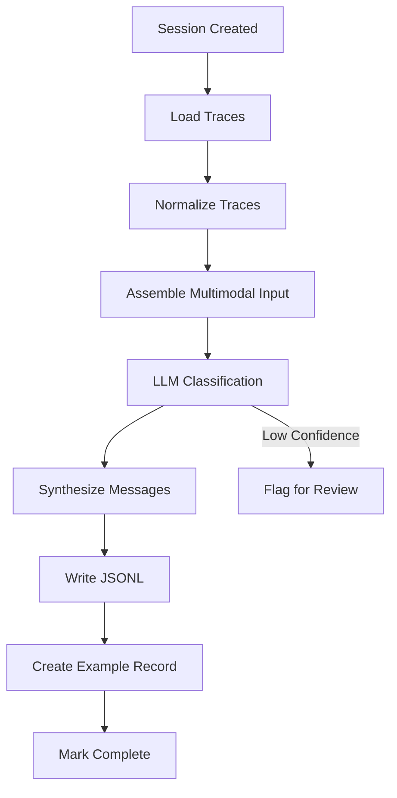

_Last reviewed: 2026-02-11_

## Lineage

This pipeline is derived from the [AutoActivity task input trace to training data pipeline](https://github.com/CRSS-AI/autoactivity-docs/blob/main/docs/data_pipelines/poc/task_input_trace_to_training_data.md). The core transformation approach is preserved, adapted to the simplified Session→Example data model.

## Goal

Deliver a working pipeline that transforms raw Session trace data into structured Examples suitable for model training.

## Scope

- Session trace ingestion from storage
- Multimodal trace normalization
- LLM-powered action classification
- Example synthesis with JSONL output
- Processing status tracking

## Deliverables

- [ ] Trace loader: Read Session traces from storage
- [ ] Trace normalizer: Standardize input events, network, screenshots
- [ ] Action classifier: LLM-based trace-to-action mapping
- [ ] Example synthesizer: Generate training messages
- [ ] JSONL writer: Serialize examples to storage
- [ ] Processing orchestrator: Coordinate pipeline stages
- [ ] Status API: Report processing progress

## Success Criteria

1. Pipeline processes a Session end-to-end without manual intervention
2. Output Examples contain valid JSONL training messages
3. Action classifications match expected actions for known test traces
4. Processing status is queryable via API
5. Failed processing produces actionable error logs

## Dependencies

- Backend MVP: Session and Example APIs must be available
- LLM API access (OpenRouter or similar)
- At least one Suite with defined Actions for classification

## Risks & Mitigations

| Risk | Mitigation |
|------|------------|
| LLM classification accuracy | Include confidence scores; flag low-confidence for review |
| Processing latency for large traces | Implement async processing with status polling |
| LLM API rate limits | Configure backoff; batch requests where possible |
| Screenshot encoding costs | Sample screenshots; use efficient encoding |

## Implementation Notes

### Technology Choices

- Python for pipeline logic
- Async processing (Celery, or simple queue)
- OpenRouter for LLM access (multi-provider)
- Pydantic for trace and example models

### Pipeline Flow



### Example Output Format

Examples are stored as JSONL at `examples/<example-id>/messages.jsonl`:

```jsonl
{"role": "system", "content": "You are an assistant that helps users interact with Gmail..."}
{"role": "user", "content": "Compose a new email to alice@example.com with subject 'Meeting Tomorrow'"}
{"role": "assistant", "content": null, "tool_calls": [{"name": "compose_email", "arguments": {"to": "alice@example.com", "subject": "Meeting Tomorrow"}}]}
```

### Configuration

Each Example records:
- `modelId`: Which Model was used for classification
- `modelConfiguration`: Provider-specific settings (temperature, etc.)
- `actionToolMapId`: Which action-tool mapping was applied
