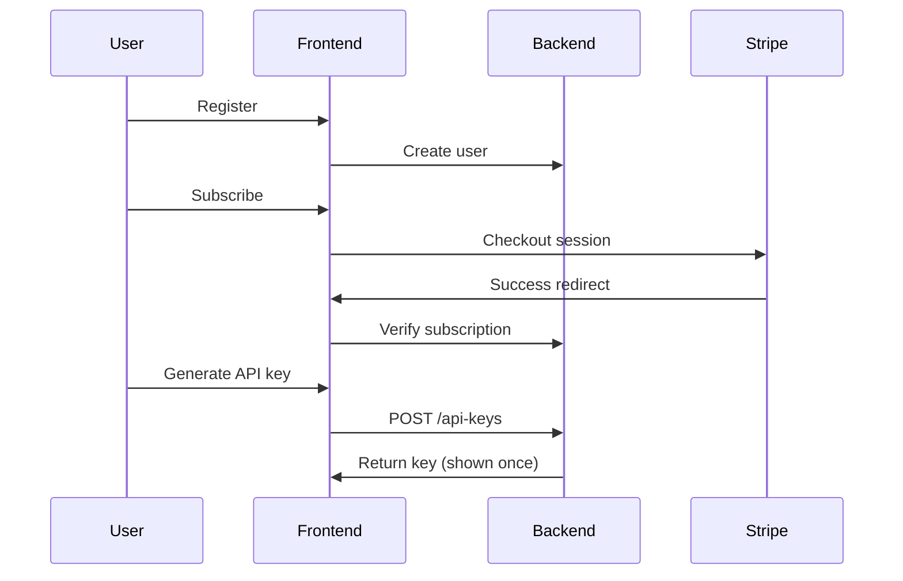

_Last reviewed: 2026-02-05_

## Goal

Deliver a functional storefront where users can register accounts, set up payment methods via Stripe/Link, and obtain API keys for accessing Tracepipe services.

## Scope

- User registration and authentication
- Stripe integration with working payments
- API key generation and management UI
- Basic usage dashboard

## Deliverables

- [ ] Landing page with product overview
- [ ] User registration and login flow
- [ ] Stripe Checkout integration for subscriptions
- [ ] Stripe Customer Portal for billing management
- [ ] API key generation page
- [ ] API key list with revocation capability
- [ ] Basic usage metrics display

## Success Criteria

1. New user can register, subscribe, and generate an API key in under 5 minutes
2. Payment processing works end-to-end with Stripe test mode
3. API keys authenticate successfully against Backend API
4. User can view and revoke their API keys

## Dependencies

- Backend PoC: User and API key endpoints must be available
- Stripe account configuration

## Risks & Mitigations

| Risk | Mitigation |
|------|------------|
| Stripe integration complexity | Use Stripe Checkout (hosted) to minimize custom code |
| Auth provider selection delays | Start with simple email/password; add OAuth later |
| Scope creep to admin features | Defer organization/team management to future milestone |

## Implementation Notes

### Technology Choices

- Prefer static-first architecture (Next.js, Astro, or similar)
- Use Stripe's hosted checkout and customer portal
- Minimal backend requirements—most state lives in Stripe and Backend API

### API Key Flow

## Related Documents

- [Frontend Overview](../../frontend/overview.md)
- [Backend PoC](backend.md)
- [Data Model](../../data_model.md) — User entity
