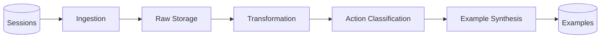
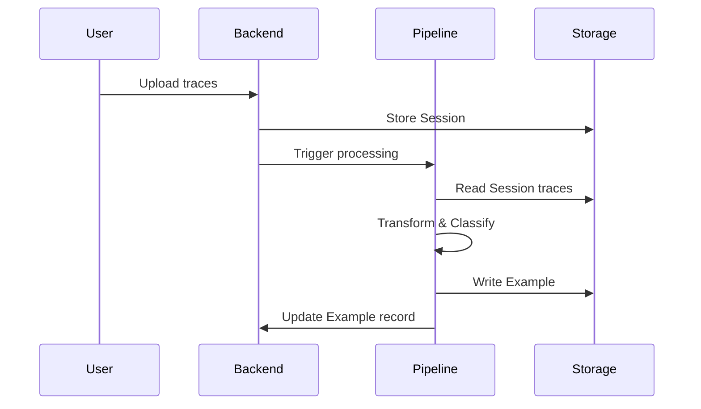

# Data Pipelines Overview

_Last reviewed: 2026-02-05_

## Lineage

This pipeline architecture is derived from the [AutoActivity data pipelines](https://github.com/CRSS-AI/autoactivity-docs/blob/main/docs/data_pipelines/overview.md). The core transformation flow is preserved, with the execution layer simplified to Session→Example processing.

## Purpose

Transform raw Session trace data into structured Examples suitable for model training.

## Pipeline Architecture

## Pipeline Stages

### 1. Ingestion

Validates and stores incoming Session data:

- Trace format validation (JSONL structure, required fields)
- Screenshot format validation (PNG, timestamps)
- Storage path assignment
- Session record creation

### 2. Transformation

Normalizes trace data for classification:

- Input event normalization (keyboard, mouse, touch)
- Network traffic filtering (relevant endpoints only)
- Screenshot sampling and encoding
- Multimodal trace assembly

### 3. Action Classification

Identifies canonical Actions from trace evidence:

- LLM-powered trace interpretation
- Suite-scoped action matching
- Parameter extraction from trace context
- Confidence scoring

### 4. Example Synthesis

Generates training messages from classified actions:

- ActionToolMap lookup for target format
- Tool call formatting
- Conversation structure assembly
- JSONL serialization to storage

## Configuration

Each Example records the Model and `modelConfiguration` used during synthesis, enabling reproducibility and A/B testing across different LLM configurations.

## Data Flow

## Quality Controls

- Trace format validation at ingestion
- Classification confidence thresholds
- Example format validation before storage
- Processing audit logs

## Related Documents

- [Data Model](../data_model.md) — Session and Example schemas
- [Backend Overview](../backend/overview.md) — Session ingestion API
- [Pipelines PoC](../milestones/pipelines-poc.md) — Current milestone
